# AWS Self-Healing Infrastructure - Tesi d'Esame

## Indice dei Contenuti

- [AWS Self-Healing Infrastructure - Tesi d'Esame](#aws-self-healing-infrastructure---tesi-desame)
  - [Indice dei Contenuti](#indice-dei-contenuti)
  - [Indice delle Figure](#indice-delle-figure)
  - [Sezione 1 - Contesto, Architettura e Obiettivi di Self-Healing](#sezione-1---contesto-architettura-e-obiettivi-di-self-healing)
    - [1.1 Introduzione e Contesto del Progetto](#11-introduzione-e-contesto-del-progetto)
    - [1.2 Cos'è il Self-Healing e Perché Serve](#12-cosè-il-self-healing-e-perché-serve)
    - [1.3 Principi di Chaos Engineering](#13-principi-di-chaos-engineering)
    - [1.4 Requisiti Funzionali e Non Funzionali](#14-requisiti-funzionali-e-non-funzionali)
    - [1.5 Architettura Generale della Soluzione](#15-architettura-generale-della-soluzione)
    - [1.6 Stack Tecnologico](#16-stack-tecnologico)
    - [1.7 Flusso End-to-End di un Evento di Self-Healing](#17-flusso-end-to-end-di-un-evento-di-self-healing)
    - [1.8 Dashboard di Monitoraggio - Stato Baseline](#18-dashboard-di-monitoraggio---stato-baseline)
  - [Sezione 2 - IaC \& Lifecycle Management](#sezione-2---iac--lifecycle-management)
    - [2.1 Principi di Infrastructure as Code](#21-principi-di-infrastructure-as-code)
    - [2.2 Struttura del Progetto Terraform](#22-struttura-del-progetto-terraform)
    - [2.3 Provisioning dell'Infrastruttura](#23-provisioning-dellinfrastruttura)
    - [2.4 IAM e Gestione delle Credenziali](#24-iam-e-gestione-delle-credenziali)
    - [2.5 CloudWatch Alarms - Definizione e Soglie](#25-cloudwatch-alarms---definizione-e-soglie)
    - [2.6 Rifattorizzazione Architetturale per Cost Optimization](#26-rifattorizzazione-architetturale-per-cost-optimization)
    - [2.7 Teardown e Gestione del Ciclo di Vita](#27-teardown-e-gestione-del-ciclo-di-vita)
  - [Sezione 3 - Orchestration \& Event-Driven Remediation](#sezione-3---orchestration--event-driven-remediation)
    - [3.1 Event-Driven Architecture - Pattern SNS → Webhook](#31-event-driven-architecture---pattern-sns--webhook)
    - [3.2 Configurazione AWS SNS e Alerting Diretto](#32-configurazione-aws-sns-e-alerting-diretto)
    - [3.3 Setup Grafana - DataSource CloudWatch e Service Account](#33-setup-grafana---datasource-cloudwatch-e-service-account)
    - [3.4 Configurazione n8n - Credenziali e Integrazioni](#34-configurazione-n8n---credenziali-e-integrazioni)
    - [3.5 Self-Healing Router - Logica di Smistamento](#35-self-healing-router---logica-di-smistamento)
    - [3.6 Workflow di Remediation - I 4 Scenari](#36-workflow-di-remediation---i-4-scenari)
      - [3.6.1 Healing 1 - Container Crash](#361-healing-1---container-crash)
      - [3.6.2 Healing 2 - CPU Overload](#362-healing-2---cpu-overload)
      - [3.6.3 Healing 3 - Memory Leak](#363-healing-3---memory-leak)
      - [3.6.4 Healing 4 - Disk Full](#364-healing-4---disk-full)
    - [3.7 Notifiche e Observability Loop](#37-notifiche-e-observability-loop)
    - [3.8 Stress Test 1 - Container Crash (Synthetic HTTP Check)](#38-stress-test-1---container-crash-synthetic-http-check)
      - [Scenario e Trigger di Errore](#scenario-e-trigger-di-errore)
      - [Esecuzione del Chaos Test](#esecuzione-del-chaos-test)
      - [Risposta Automatica del Sistema](#risposta-automatica-del-sistema)
      - [Metriche e Verifiche](#metriche-e-verifiche)
    - [3.9 Stress Test 2 - CPU Overload](#39-stress-test-2---cpu-overload)
      - [Scenario e Trigger di Errore](#scenario-e-trigger-di-errore-1)
      - [Esecuzione del Chaos Test](#esecuzione-del-chaos-test-1)
      - [Risposta Automatica del Sistema](#risposta-automatica-del-sistema-1)
      - [Metriche e Verifiche](#metriche-e-verifiche-1)
  - [Sezione 4 - Chaos Engineering, Stress Test e Metriche](#sezione-4---chaos-engineering-stress-test-e-metriche)
    - [4.1 Design degli Scenari di Test](#41-design-degli-scenari-di-test)
    - [4.2 Stress Test 3 - Memory Leak](#42-stress-test-3---memory-leak)
      - [Scenario e Trigger di Errore](#scenario-e-trigger-di-errore-2)
      - [Esecuzione del Chaos Test](#esecuzione-del-chaos-test-2)
      - [Risposta Automatica del Sistema](#risposta-automatica-del-sistema-2)
      - [Metriche e Verifiche](#metriche-e-verifiche-2)
    - [4.3 Stress Test 4 - Disk Full](#43-stress-test-4---disk-full)
      - [Scenario e Trigger di Errore](#scenario-e-trigger-di-errore-3)
      - [Esecuzione del Chaos Test](#esecuzione-del-chaos-test-3)
      - [Risposta Automatica del Sistema](#risposta-automatica-del-sistema-3)
      - [Metriche e Verifiche](#metriche-e-verifiche-3)
    - [4.4 Tabella Riepilogativa dei Risultati](#44-tabella-riepilogativa-dei-risultati)
    - [4.5 Lezioni Apprese e Miglioramenti Futuri](#45-lezioni-apprese-e-miglioramenti-futuri)

## Indice delle Figure

1. [Figura 1 – Dashboard Grafana in condizioni baseline - panoramica dei quattro pannelli di monitoraggio.](#fig-1)
2. [Figura 2 – Esecuzione di terraform apply - fase di creazione risorse.](#fig-2)
3. [Figura 3 – Email di notifica CloudWatch ricevuta via SNS.](#fig-3)
4. [Figura 4 – Workflow completo del Self-Healing Router in n8n.](#fig-4)
5. [Figura 5 – Workflow n8n: Healing 1 - Container Crash.](#fig-5)
6. [Figura 6 – Workflow n8n: Healing 2 - CPU Overload.](#fig-6)
7. [Figura 7 – Workflow n8n: Healing 3 - Memory Leak.](#fig-7)
8. [Figura 8 – Workflow n8n: Healing 4 - Disk Full.](#fig-8)
9. [Figura 9 – Esecuzione del workflow Healing 1 - successo L1.](#fig-9)
10. [Figura 10 – Annotation Grafana: Container Crash risolto.](#fig-10)
11. [Figura 11 – Terminale: esecuzione dello script chaos-cpu.sh.](#fig-11)
12. [Figura 12 – Dashboard Grafana post-healing: CPU normalizzato.](#fig-12)
13. [Figura 13 – Terminale + Grafana: esecuzione chaos-memory.sh con spike visibile.](#fig-13)
14. [Figura 14 – Annotation Grafana: Memory Leak - L1 healed.](#fig-14)
15. [Figura 15 – Terminale + Grafana: esecuzione chaos-disk.sh con gauge al 51.7%.](#fig-15)
16. [Figura 16 – Annotation Grafana: Disk Full - L1 cleanup riuscito.](#fig-16)

---

## Sezione 1 - Contesto, Architettura e Obiettivi di Self-Healing

_Relatore 1_

### 1.1 Introduzione e Contesto del Progetto

Negli ambienti cloud moderni, il downtime non pianificato rappresenta uno dei rischi operativi più critici per le organizzazioni. Ogni minuto di indisponibilità si traduce in perdita economica diretta, degrado della reputazione e violazione degli SLA contrattuali. Le cause più frequenti di interruzione - saturazione delle risorse computazionali, crash applicativi, esaurimento dello spazio disco - condividono una caratteristica comune: sono prevedibili, rilevabili e, nella maggior parte dei casi, risolvibili senza intervento umano.

Il presente progetto, sviluppato nell'ambito del percorso ITS Cloud Administrator, affronta questa problematica progettando e implementando una **piattaforma di infrastruttura auto-riparante (self-healing)** su Amazon Web Services. L'obiettivo è dimostrare come, attraverso l'integrazione di servizi di monitoraggio, orchestrazione e automazione, sia possibile costruire un sistema capace di rilevare autonomamente anomalie infrastrutturali ed eseguire azioni correttive automatiche, senza alcun intervento manuale da parte dell'operatore.

### 1.2 Cos'è il Self-Healing e Perché Serve

Con il termine **self-healing infrastructure** si intende un'architettura in grado di rilevare condizioni di degrado o guasto nei propri componenti e di attivare automaticamente procedure di ripristino, riportando il sistema a uno stato operativo conforme. Questo concetto si colloca all'intersezione tra due discipline:

- **Site Reliability Engineering (SRE)**: l'approccio ingegneristico alla gestione dei sistemi in produzione, formalizzato da Google, che pone al centro l'automazione come mezzo per ridurre il _toil_ (lavoro operativo manuale e ripetitivo) e garantire affidabilità misurata tramite SLO (Service Level Objectives).
- **Chaos Engineering**: la pratica di introdurre intenzionalmente perturbazioni controllate in un sistema per verificarne la resilienza, formalizzata da Netflix con il progetto Chaos Monkey.

Il self-healing opera in modalità **reattiva**: il sistema non previene il guasto, ma lo rileva tempestivamente e risponde con un'azione correttiva predefinita. Il ciclo di vita di un evento di self-healing si articola in tre fasi:

1. **Detection** - un sistema di monitoraggio rileva il superamento di una soglia critica.
2. **Remediation** - un orchestratore esegue un'azione correttiva (kill del processo, cleanup, reboot).
3. **Verification** - il sistema verifica che la metrica sia rientrata nei limiti attesi e annota l'esito.

### 1.3 Principi di Chaos Engineering

Il Chaos Engineering è la disciplina di sperimentare su un sistema distribuito allo scopo di costruire fiducia nella sua capacità di resistere a condizioni turbolente in produzione. Reso celebre da Netflix con lo strumento Chaos Monkey, questo approccio non consiste nel rompere le cose casualmente, ma nel validare ipotesi di resilienza tramite esperimenti controllati. In questo progetto, l'obiettivo è dimostrare che l'infrastruttura di self-healing è effettivamente in grado di sopravvivere alle quattro principali cause di disservizio infrastrutturale. Ogni test è stato progettato limitando il _blast radius_ (raggio d'azione) al singolo Worker Node, senza compromettere il Control Node.

### 1.4 Requisiti Funzionali e Non Funzionali

La piattaforma è stata progettata per soddisfare i seguenti requisiti:

**Requisiti funzionali:**

| ID    | Requisito               | Descrizione                                                                                                                                |
| ----- | ----------------------- | ------------------------------------------------------------------------------------------------------------------------------------------ |
| RF-01 | Rilevamento anomalie    | Il sistema deve rilevare automaticamente 4 tipologie di anomalia: container crash, CPU overload, memory leak, disk full                    |
| RF-02 | Remediation automatica  | Per ciascuna anomalia, il sistema deve eseguire un'azione correttiva senza intervento umano                                                |
| RF-03 | Escalation multilivello | Se la remediation di primo livello (L1) non risolve il problema, il sistema deve escalare a un'azione di secondo livello (L2)              |
| RF-04 | Tracciabilità           | Ogni evento di self-healing deve essere annotato sulla dashboard di monitoraggio con timestamp, tipo di anomalia, azione eseguita ed esito |
| RF-05 | Notifica operatore      | Il sistema deve inviare notifiche email all'operatore tramite AWS SNS per ogni transizione di stato degli allarmi                          |

**Requisiti non funzionali:**

| ID     | Requisito            | Target                                                                   |
| ------ | -------------------- | ------------------------------------------------------------------------ |
| RNF-01 | Tempo di rilevamento | < 60 secondi dal verificarsi dell'anomalia                               |
| RNF-02 | Tempo di remediation | < 5 minuti dall'attivazione dell'allarme                                 |
| RNF-03 | Autonomia operativa  | Zero intervento umano durante il ciclo detect → fix → verify             |
| RNF-04 | Costo a riposo       | Zero costi fissi nei periodi di inattività (pattern destroy/reapply)     |
| RNF-05 | Riproducibilità      | Infrastruttura interamente codificata e ricreabile da zero in < 5 minuti |

### 1.5 Architettura Generale della Soluzione

L'architettura è composta da due istanze EC2 distinte (Dual-Node) nella regione `eu-south-1` (Milano), integrate con i servizi gestiti AWS per il monitoraggio e la notifica degli eventi. La suddivisione prevede:

- **Control Node (Doctor)**: ospita lo stack di monitoraggio e orchestrazione (n8n, Grafana).
- **Worker Node (Target)**: ospita i carichi applicativi (Nginx, Docker) ed è il target controllato su cui agiscono gli script di chaos.

La motivazione tecnica alla base di questa separazione è isolare il piano di controllo (control plane) dal piano dati (data plane): in questo modo si evita che la saturazione del nodo target comprometta le risorse necessarie al motore di remediation per intervenire.

```
┌─────────────────────────────────────────────────────────────────────────┐
│                          AWS eu-south-1 (Milano)                        │
│                                                                         │
│  ┌───────────────────────────────────────────────────────────────────┐  │
│  │              EC2 t3.micro - Amazon Linux 2023                     │  │
│  │              Elastic IP: 51.118.61.93                             │  │
│  │                                                                   │  │
│  │   ┌──────────┐    ┌───────────┐    ┌──────────┐                   │  │
│  │   │  nginx   │    │  Grafana  │    │   n8n    │                   │  │
│  │   │  :80     │    │  :3000    │    │  :5678   │                   │  │
│  │   └──────────┘    └───────────┘    └──────────┘                   │  │
│  │              Docker Compose Stack                                 │  │
│  └───────────────────────────────────────────────────────────────────┘  │
│           │                    ▲                    │                   │
│           │ metriche           │ annotations        │ SSH remediation   │
│           ▼                    │                    ▼                   │
│  ┌─────────────────┐   ┌─────────────┐   ┌───────────────────┐          │
│  │  CloudWatch     │──▶│  SNS Topic  │──▶│  n8n Webhook      │          │
│  │  Alarms         │   │  (email +   │   │  /cloudwatch-     │          │
│  │                 │   │   HTTPS)    │   │   alerts          │          │
│  └─────────────────┘   └─────────────┘   └───────────────────┘          │
│                                                                         │
│  ┌─────────────────┐                                                    │
│  │  S3 Bucket      │  ← Terraform State                                 │
│  └─────────────────┘                                                    │
└─────────────────────────────────────────────────────────────────────────┘
```

Il flusso architetturale si articola come segue: le metriche dell'istanza EC2 vengono raccolte nativamente da **Amazon CloudWatch**, che valuta gli allarmi configurati. Al superamento delle soglie, CloudWatch pubblica una notifica sul **Topic SNS** (`selfhealing-monitoring-alerts`), il quale inoltra il messaggio sia via email all'operatore, sia via HTTPS al webhook di **n8n**. L'orchestratore n8n analizza il payload, identifica il tipo di anomalia e attiva il workflow di remediation appropriato, eseguendo comandi correttivi sull'istanza tramite SSH. Al termine dell'operazione, n8n annota l'esito direttamente sulla dashboard di **Grafana** tramite l'API Annotations, completando il ciclo di osservabilità.

### 1.6 Stack Tecnologico

La soluzione impiega i seguenti componenti, ciascuno con un ruolo specifico all'interno dell'architettura:

| Componente            | Categoria                   | Ruolo nel Progetto                                                                                              |
| --------------------- | --------------------------- | --------------------------------------------------------------------------------------------------------------- |
| **Terraform**         | Infrastructure as Code      | Provisioning dichiarativo di tutte le risorse AWS; gestione del ciclo di vita destroy/reapply                   |
| **Docker Compose**    | Containerizzazione          | Orchestrazione locale dei servizi applicativi (n8n, Grafana, nginx) sull'istanza EC2                            |
| **Amazon CloudWatch** | Monitoraggio (AWS managed)  | Raccolta metriche EC2 e valutazione degli allarmi su soglie predefinite                                         |
| **Amazon SNS**        | Messaggistica (AWS managed) | Disaccoppiamento event-driven: propaga gli allarmi via HTTPS al webhook n8n e via email all'operatore           |
| **n8n**               | Orchestrazione workflow     | Motore decisionale: riceve gli allarmi, classifica l'anomalia, esegue la remediation via SSH, annota su Grafana |
| **Grafana**           | Osservabilità e dashboard   | Visualizzazione real-time delle metriche CloudWatch e storico eventi tramite Annotations                        |
| **nginx**             | Applicazione target         | Servizio web dimostrativo utilizzato come target per i test di container crash                                  |
| **Bash**              | Scripting                   | Chaos scripts per l'iniezione controllata di anomalie e comandi di remediation                                  |

L'infrastruttura adotta un approccio Dual-Node per garantire il corretto isolamento tra il sistema di orchestrazione (Control Node) e i carichi applicativi (Worker Node), replicando pattern di affidabilità propri degli ambienti produttivi pur mantenendo i costi contenuti.

### 1.7 Flusso End-to-End di un Evento di Self-Healing

Il ciclo completo di un evento di self-healing, dall'insorgenza dell'anomalia alla chiusura dell'incidente, attraversa le seguenti fasi:

```
  Anomalia                CloudWatch              SNS Topic
  (es. CPU > 80%)   ───▶  Alarm ACTIVE   ───▶   Publish
       │                                           │
       │                                     ┌─────┴─────┐
       │                                     │           │
       │                                   email      HTTPS POST
       │                                (operatore)  (n8n webhook)
       │                                                 │
       │                                                 ▼
       │                                          ┌────────────┐
       │                                          │ n8n Router │
       │                                          │ Parse +    │
       │                                          │ Route by   │
       │                                          │ alarm type │
       │                                          └─────┬──────┘
       │                                                │
       │                                                ▼
       │                                     ┌───────────────────┐
       │                                     │ Healing Workflow  │
       │                                     │ L1: Kill / Clean  │──── OK ───▶ Annotation L1
       │                                     │ Wait 90s          │
       │                                     │ Check metrica     │
       │                                     │ Still High?       │
       │                                     │ L2: Reboot        │──── OK ───▶ Annotation L2
       │                                     └───────────────────┘
       │                                                │
       ▼                                                ▼
  CloudWatch                                    Grafana Dashboard
  Alarm → OK                                   (Annotation visibile)
```

La logica di **escalation multilivello** è un elemento chiave dell'architettura: ogni workflow tenta inizialmente una remediation conservativa di primo livello (L1), verifica l'efficacia attendendo 90 secondi e ricontrollando la metrica, e solo in caso di persistenza del problema scala a un intervento più aggressivo di secondo livello (L2, tipicamente il reboot dell'istanza). Questa strategia minimizza l'impatto operativo delle azioni correttive, evitando riavvii non necessari.

### 1.8 Dashboard di Monitoraggio - Stato Baseline

La dashboard Grafana, denominata **Self-Healing Worker Node Health**, costituisce il pannello di controllo centrale dell'infrastruttura. In condizioni operative normali (baseline), presenta quattro pannelli corrispondenti ai quattro scenari di anomalia monitorati:

1. **Status Check Failed** (Stress Test 1) - stato dell'istanza EC2: `UP` / `DOWN`
2. **CPU Utilization** (Stress Test 2) - percentuale di utilizzo CPU nel tempo
3. **Memory Usage** (Stress Test 3) - percentuale di memoria utilizzata
4. **Disk Usage** (Stress Test 4) - percentuale di occupazione disco (gauge)

Durante l'esecuzione dei chaos test, le Annotations di Grafana vengono sovrapposte ai grafici come marker verticali, consentendo di correlare visivamente il momento dell'anomalia, l'intervento del sistema e il ripristino della metrica.

<a id="fig-1"></a>
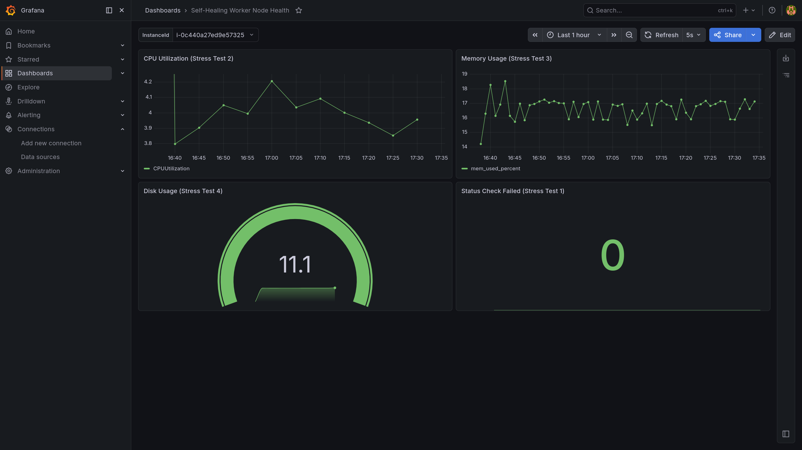
_Figura 1 – Dashboard Grafana in condizioni baseline - panoramica dei quattro pannelli di monitoraggio._

---

---

---

## Sezione 2 - IaC & Lifecycle Management

_Relatore 2_

### 2.1 Principi di Infrastructure as Code

L'intera infrastruttura del progetto è stata definita in modo dichiarativo tramite **Terraform** (HashiCorp), adottando il paradigma Infrastructure as Code (IaC). Questo approccio garantisce tre proprietà fondamentali:

- **Idempotenza**: ogni esecuzione di `terraform apply` converge verso lo stato desiderato, indipendentemente dallo stato iniziale. Se le risorse esistono già e corrispondono alla configurazione, non vengono modificate.
- **Versionamento**: i file `.tf` sono tracciati in un repository Git, consentendo audit completo di ogni modifica infrastrutturale e rollback immediato a qualsiasi revisione precedente.
- **Riproducibilità**: l'intero ambiente può essere distrutto con `terraform destroy` e ricreato identico con un singolo `terraform apply`. Questa capacità è cruciale per il ciclo di vita del progetto, come descritto nella sezione 2.7.

Lo state di Terraform viene persistito su un **bucket S3 remoto** (`terraform-state-selfhealing-1770562384`) nella regione `eu-south-1`, evitando conflitti tra sessioni di lavoro e garantendo la persistenza del mapping tra risorse dichiarate e risorse AWS effettive.

### 2.2 Struttura del Progetto Terraform

I file Terraform sono organizzati per servizio AWS: ogni risorsa è isolata in un file dedicato, semplificando la manutenzione e la leggibilità. Terraform carica automaticamente tutti i file `.tf` presenti nella stessa directory.

```
terraform/
└── environments/
    └── dev/
        ├── backend.tf       # Backend S3 per state remoto
        ├── main.tf          # Provider AWS + Data Sources (AMI, VPC)
        ├── ec2.tf           # Security Group, Key Pair, EC2, Elastic IP
        ├── cloudwatch.tf    # CloudWatch Alarms (CPU, StatusCheck)
        ├── variables.tf     # Variabili configurabili (region, instance_type, project_name)
        └── outputs.tf       # Output post-deploy (Elastic IP, DNS pubblico)
```

La scelta di un layout **flat per ambiente** (`environments/dev/`) anziché una struttura a moduli riflette la scala contenuta del progetto: un singolo ambiente di sviluppo con un numero limitato di risorse. Le variabili sono centralizzate in `variables.tf` con valori di default, rendendo il codice riutilizzabile per altri ambienti senza modifiche ai file di risorsa.

### 2.3 Provisioning dell'Infrastruttura

Il provisioning avviene in due fasi distinte: **inizializzazione** del backend e del provider, seguita dalla **pianificazione e applicazione** delle risorse.

**Inizializzazione:**

```bash
terraform init -reconfigure
```

Questo comando configura il backend S3 e scarica il provider `hashicorp/aws` (versione 6.31.0). Il flag `-reconfigure` forza la reinizializzazione del backend, utile dopo un ciclo destroy/reapply.

**Pianificazione e applicazione:**

```bash
terraform plan    # Anteprima delle modifiche
terraform apply   # Creazione effettiva delle risorse
```

Terraform risolve automaticamente le dipendenze tra risorse (ad esempio, l'Elastic IP dipende dall'istanza EC2, che a sua volta dipende dal Security Group) e le crea nell'ordine corretto.

Le risorse create dal provisioning completo sono riepilogate nella tabella seguente:

| Risorsa          | Identificativo                               | Dettagli                      |
| ---------------- | -------------------------------------------- | ----------------------------- |
| S3 Bucket        | `terraform-state-selfhealing-1770562384`     | State remoto Terraform        |
| Key Pair         | `selfhealing-key`                            | Chiave SSH per accesso EC2    |
| Security Group   | `selfhealing-monitoring-sg`                  | Porte: 22, 80, 3000, 5678     |
| EC2 Instance     | `selfhealing-monitoring-ec2`                 | `t3.micro`, Amazon Linux 2023 |
| Elastic IP       | `selfhealing-monitoring-eip`                 | `51.118.61.93` (statico)      |
| CloudWatch Alarm | `selfhealing-monitoring-cpu-high`            | CPU > 80% (2×5 min)           |
| CloudWatch Alarm | `selfhealing-monitoring-status-check-failed` | StatusCheckFailed > 0         |

L'istanza EC2 viene configurata automaticamente al boot tramite lo script `user_data`, che esegue in sequenza: aggiornamento del sistema operativo, installazione di Docker e Docker Compose, creazione del file `/opt/stack/docker-compose.yml` con lo stack applicativo, e avvio dei container (n8n sulla porta 5678, Grafana sulla porta 3000, nginx sulla porta 80).

<a id="fig-2"></a>
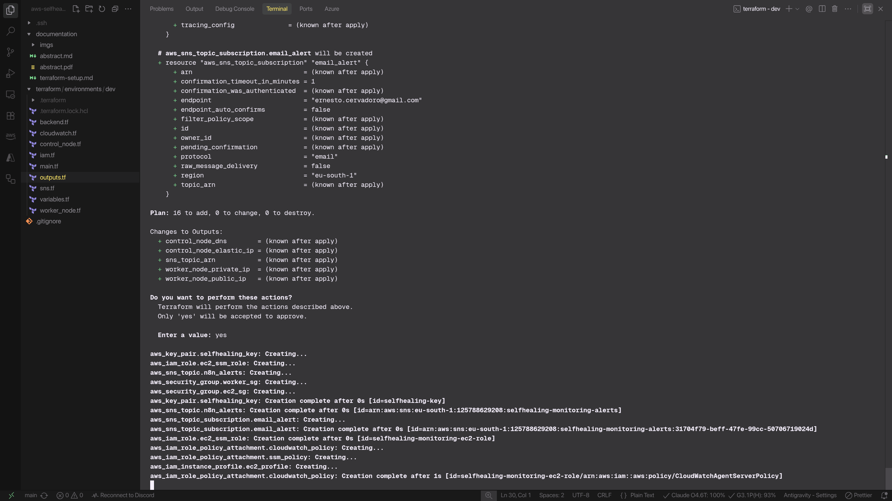
_Figura 2 – Esecuzione di terraform apply - fase di creazione risorse._

### 2.4 IAM e Gestione delle Credenziali

La gestione delle credenziali segue una separazione netta tra i due livelli di accesso:

- **Livello operatore (Terraform)**: è stata creata un'utenza IAM dedicata (`terraform-selfhealing`) con policy `AdministratorAccess` e accesso esclusivamente programmatico (Access Key + Secret Key). Le credenziali sono configurate localmente tramite `aws configure` e non sono mai committate nel repository.
- **Livello applicativo (EC2)**: l'istanza EC2 opera con il ruolo IAM `selfhealing-monitoring-ec2-role`, al quale è associata la policy gestita `CloudWatchReadOnlyAccess`. Questo consente a Grafana di interrogare le metriche CloudWatch senza l'uso di chiavi statiche, sfruttando il meccanismo nativo di Instance Profile. Nessuna credenziale AWS è presente nei container.

Questa architettura a due livelli rispetta il principio del **least privilege**: Terraform dispone di permessi ampi solo durante le operazioni di provisioning (eseguite dall'operatore), mentre le applicazioni in esecuzione dispongono esclusivamente dei permessi di lettura necessari al monitoraggio.

### 2.5 CloudWatch Alarms - Definizione e Soglie

Gli allarmi CloudWatch rappresentano il primo anello della catena di self-healing: rilevano le anomalie e pubblicano notifiche sul Topic SNS, innescando il flusso di remediation automatica. Sono definiti dichiarativamente in `cloudwatch.tf`.

**Alarm CPU High** - rileva un utilizzo anomalo della CPU:

| Parametro              | Valore                                            |
| ---------------------- | ------------------------------------------------- |
| Metrica                | `CPUUtilization` (namespace `AWS/EC2`)            |
| Soglia                 | > 80%                                             |
| Periodi di valutazione | 1                                                 |
| Intervallo per periodo | 60 secondi (Detailed Monitoring)                  |
| Statistica             | Average                                           |
| Missing data           | `notBreaching` (assenza di dati = nessun allarme) |

L'allarme è configurato per valutare la metrica su una finestra di 60 secondi (Detailed Monitoring), allineando così i tempi di detection per i test di laboratorio ed evitando attese prolungate.

**Synthetic Health Check (n8n)** - rileva l'indisponibilità del servizio web:

Per lo scenario di Container Crash, il progetto non sfrutta il generico allarme StatusCheckFailed di AWS (che valuterebbe l'intera istanza), ma un meccanismo più applicativo e preciso: un trigger schedulato direttamente su n8n (Schedule Check ogni 60 secondi) che esegue un synthetic health check HTTP verso la porta 80 (Nginx) del Worker Node. Se la richiesta fallisce o va in timeout, si innesca il workflow di remediation.

### 2.6 Rifattorizzazione Architetturale per Cost Optimization

L'architettura iniziale del progetto prevedeva un'istanza **Amazon RDS MySQL** managed per lo storico degli eventi di self-healing. Durante lo sviluppo, questa scelta è stata riconsiderata per due ragioni:

1. **Costo fisso**: un'istanza RDS, anche nella classe `db.t3.micro`, genera costi orari continui indipendentemente dall'utilizzo, in contrasto con l'obiettivo di **zero costi fissi nei periodi di inattività**.
2. **Sovradimensionamento**: le informazioni da persistere (timestamp, tipo di evento, esito della remediation) non giustificano un database relazionale managed.

La rifattorizzazione ha comportato:

- **Rimozione di RDS** tramite `terraform destroy` mirato sulle risorse database, eliminando completamente il costo fisso associato.
- **Migrazione del logging** dalle tabelle relazionali alle **Annotations di Grafana**: ogni evento di self-healing viene annotato direttamente sui grafici di monitoraggio tramite l'API Grafana, centralizzando osservabilità e storico in un unico strumento senza risorse aggiuntive.

Questa decisione ha ridotto la superficie di attacco (eliminando un endpoint database esposto) e azzerato i costi fissi infrastrutturali al di fuori delle sessioni di test.

### 2.7 Teardown e Gestione del Ciclo di Vita

Un aspetto distintivo di questo progetto è la gestione consapevole del **ciclo di vita infrastrutturale** tramite il pattern **destroy/reapply**. Poiché l'infrastruttura è interamente codificata in Terraform, è possibile:

1. **Distruggere** tutte le risorse con `terraform destroy` al termine di una sessione di lavoro, azzerando istantaneamente i costi AWS.
2. **Ricreare** l'ambiente identico con `terraform apply` alla sessione successiva, in circa 3-5 minuti.

Questo ciclo è reso possibile da tre accorgimenti architetturali:

- **State remoto su S3**: il bucket S3 non viene distrutto durante il teardown, garantendo la persistenza del mapping tra configurazione e risorse.
- **Elastic IP statico**: l'indirizzo IP `51.118.61.93` rimane riservato anche dopo la distruzione dell'istanza EC2, evitando la necessità di riconfigurare endpoint e subscription SNS.
- **User Data idempotente**: lo script di bootstrap dell'EC2 reinstalla e configura automaticamente l'intero stack Docker ad ogni avvio, senza intervento manuale.

Il costo operativo del progetto risulta quindi proporzionale esclusivamente al **tempo di utilizzo effettivo**, allineandosi al modello pay-per-use del cloud e al principio FinOps di eliminazione degli sprechi. Durante i periodi di inattività, l'unico costo residuo è quello dell'Elastic IP non associato (circa $0.005/ora) e dello storage S3 per lo state file (trascurabile).

---

---

---

## Sezione 3 - Orchestration & Event-Driven Remediation

_Relatore 3_

### 3.1 Event-Driven Architecture - Pattern SNS → Webhook

L'orchestrazione degli eventi di self-healing si basa su un'architettura **event-driven**, che disaccoppia il rilevamento delle anomalie dall'esecuzione delle azioni correttive. Invece di adottare un approccio a polling continuo (che consumerebbe risorse e aumenterebbe la latenza), il sistema sfrutta un modello **push**:

1. **Amazon CloudWatch** monitora le metriche e, al superamento di una soglia, cambia stato (da `OK` ad `ALARM`).
2. Il cambiamento di stato innesca la pubblicazione di un evento su un **Topic SNS** (Simple Notification Service).
3. SNS agisce da message broker, inoltrando istantaneamente il payload in formato JSON tramite una richiesta HTTPS POST a un endpoint esposto da **n8n** (Webhook).

Questo pattern garantisce reattività in tempo reale, elevata scalabilità e separazione delle responsabilità tra monitoraggio e orchestrazione.

### 3.2 Configurazione AWS SNS e Alerting Diretto

Per gestire la distribuzione degli allarmi, è stato creato il Topic SNS `selfhealing-monitoring-alerts`. La configurazione prevede due subscription distinte per gestire parallelamente l'automazione e l'alerting verso l'amministratore:

1. **Subscription HTTPS (Webhook n8n)**: Registrando l'endpoint `/webhook/cloudwatch-alerts` di n8n tramite AWS CLI. Il webhook in n8n implementa una logica di autoconferma: intercetta i messaggi con header `x-amz-sns-message-type: SubscriptionConfirmation`, estrae la `SubscribeURL` fornita da AWS ed esegue una chiamata GET per validare automaticamente la propria iscrizione.
2. **Subscription Email (Admin Alerting)**: Per garantire che l'amministratore di sistema sia sempre informato in tempo reale sugli incidenti, è stata aggiunta una subscription diretta di tipo Email al Topic SNS. Ad ogni transizione di stato degli allarmi (`ALARM` o `OK`), AWS invia una notifica email contenente i dettagli dell'anomalia. Questa configurazione, nativa e resiliente, rappresenta l'unico canale ufficiale per le notifiche umane nel progetto.

<a id="fig-3"></a>
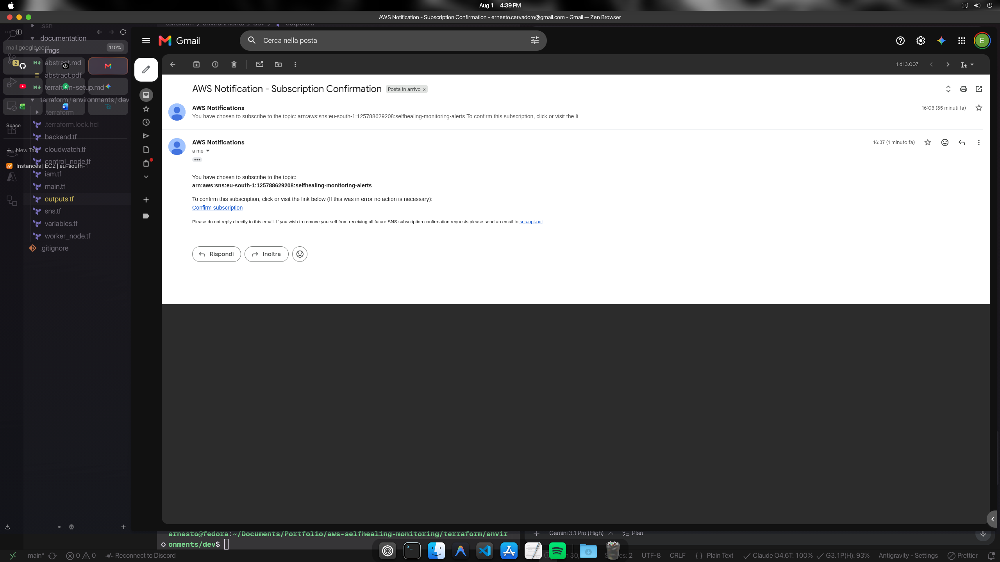
_Figura 3 – Email di notifica CloudWatch ricevuta via SNS._

### 3.3 Setup Grafana - DataSource CloudWatch e Service Account

Per chiudere il ciclo di osservabilità, Grafana deve poter sia leggere le metriche da CloudWatch, sia ricevere le annotazioni da n8n. La configurazione, automatizzata via script (`setup_grafana.sh`), prevede due step fondamentali:

- **Provisioning del DataSource CloudWatch**: Configurato con `authType: default`, sfrutta in modo trasparente l'Instance Profile dell'EC2 (policy `CloudWatchReadOnlyAccess`), eliminando la necessità di configurare chiavi statiche AWS all'interno di Grafana.
- **Service Account n8n**: È stato creato un utente di servizio interno (`n8n-integrator`) con privilegi di Editor. È stato generato un Token API che n8n utilizza per autenticare le richieste HTTP destinate alla creazione dei marker temporali (Annotations) sui grafici.

### 3.4 Configurazione n8n - Credenziali e Integrazioni

Il motore di orchestrazione (n8n) necessita di autorizzazioni per agire sui vari componenti dell'infrastruttura. Sono state configurate le seguenti credenziali in modo sicuro:

- **SSH Worker Node**: Chiave SSH privata associata all'utente `ec2-user`, utilizzata dai nodi SSH per eseguire i comandi di remediation direttamente sul sistema operativo dell'istanza.
- **Header Auth**: Il token API di Grafana (`Bearer <token>`), impiegato dai nodi HTTP Request per iniettare le Annotations.

### 3.5 Self-Healing Router - Logica di Smistamento

Il core dell'automazione è il **Self-Healing Router**, il workflow n8n principale incaricato di ricevere i webhook e smistarli ai sotto-workflow competenti. Il Router implementa la seguente pipeline logica:

1. **Ricezione ed Estrazione**: Il nodo Webhook riceve il payload JSON. Un nodo Code (`Parse Alarm`) ne estrae i metadati essenziali: nome dell'allarme, nuovo stato (`ALARM` o `OK`), metrica e namespace.
2. **Verifica dello Stato**: Un nodo condizionale (`IF`) controlla se il `newState` è `ALARM`. Se lo stato è `OK` (allarme rientrato), il router si ferma e crea un'Annotation di "Resolved" su Grafana.
3. **Routing Dinamico**: Se lo stato è `ALARM`, un nodo Switch instrada l'esecuzione in base all'`alarmName` (es. `cpu-high`, `memory-high`, `disk-high`).
4. **Trigger Sotto-Workflow**: Viene richiamato in modo sincrono (nodo `Execute Workflow`) il workflow di remediation specifico per l'anomalia rilevata.

<a id="fig-4"></a>
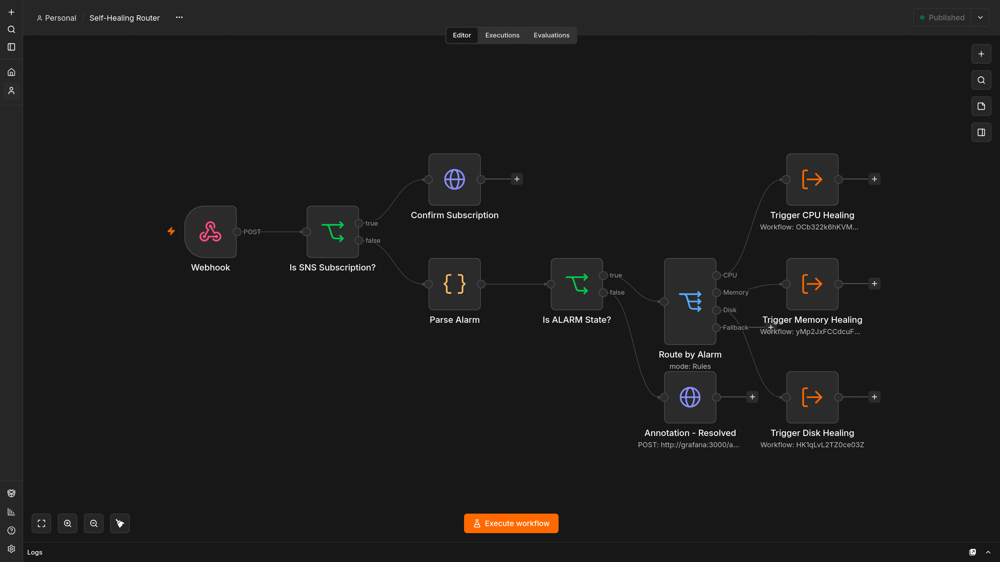
_Figura 4 – Workflow completo del Self-Healing Router in n8n._

### 3.6 Workflow di Remediation - I 4 Scenari

Ciascun workflow di remediation gestisce una singola tipologia di anomalia, incapsulando la logica di intervento e la strategia di **escalation**. Il pattern comune adottato è:

1. **L1 Fix**: Viene inviato via SSH un comando mirato per risolvere chirurgicamente il problema (es. terminare il processo che consuma più risorse).
2. **Wait & Verify**: Il workflow va in pausa per 90 secondi, consentendo al sistema di stabilizzarsi. Successivamente, esegue un nuovo check della metrica critica tramite script.
3. **Condizione di Escalation**: Un nodo `IF` verifica se la metrica è ancora oltre la soglia di guardia.
   - Se rientrata: annota su Grafana "L1 OK" e termina.
   - Se persistente: esegue la remediation di livello 2 (**L2 Escalation**, tipicamente un riavvio forzato) e annota su Grafana "L2 Escalation".

#### 3.6.1 Healing 1 - Container Crash

Innescato dal fallimento del check HTTP schedulato su n8n. Invia via SSH il comando per riavviare i container critici e verifica il ripristino del demone Docker.

<a id="fig-5"></a>
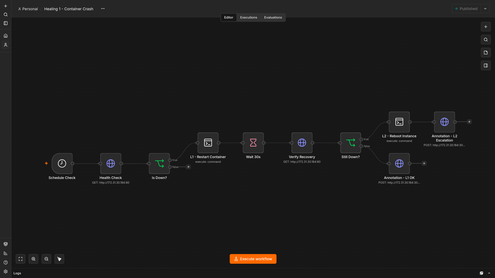
_Figura 5 – Workflow n8n: Healing 1 - Container Crash._

#### 3.6.2 Healing 2 - CPU Overload

Innescato dall'allarme `cpu-high`. L'intervento L1 consiste in uno script bash che individua e termina il singolo processo con il maggior consumo di CPU. Se dopo 90 secondi la CPU totale supera ancora l'80%, scatta l'escalation L2 (`sudo reboot`).

<a id="fig-6"></a>
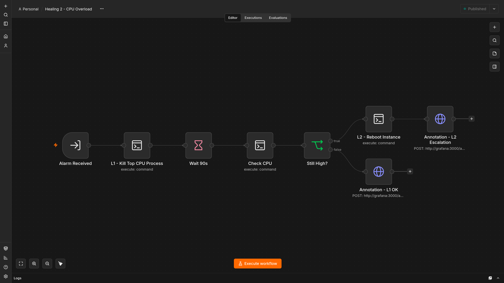
_Figura 6 – Workflow n8n: Healing 2 - CPU Overload._

#### 3.6.3 Healing 3 - Memory Leak

Innescato da anomalie nell'utilizzo della memoria RAM. Similmente alla CPU, individua i processi con anomalie di allocazione e forza il rilascio delle risorse (L1).

<a id="fig-7"></a>
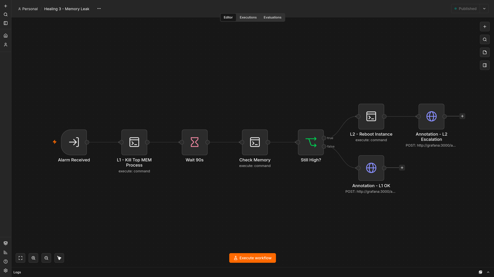
_Figura 7 – Workflow n8n: Healing 3 - Memory Leak._

#### 3.6.4 Healing 4 - Disk Full

Innescato dall'esaurimento dello spazio su disco. La remediation L1 esegue una routine di pulizia aggressiva: `docker system prune`, vacuum dei log di systemd (`journalctl --vacuum-size=50M`) e rimozione dei file temporanei in `/tmp`.

<a id="fig-8"></a>
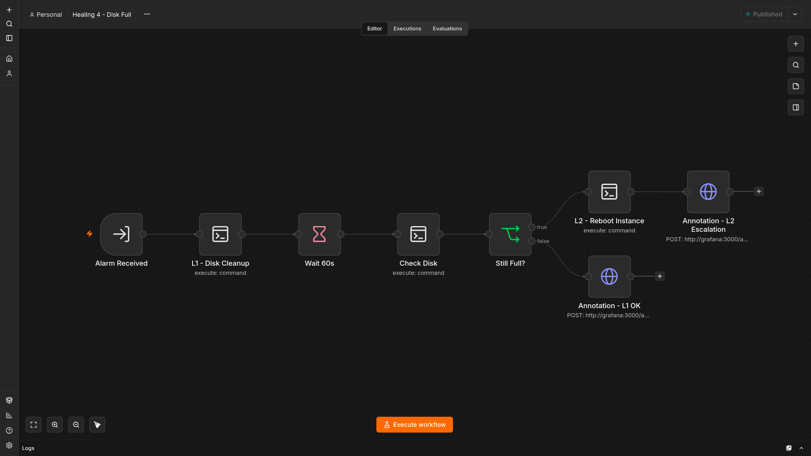
_Figura 8 – Workflow n8n: Healing 4 - Disk Full._

### 3.7 Notifiche e Observability Loop

L'architettura descritta realizza un \*\*Observab

### 3.8 Stress Test 1 - Container Crash (Synthetic HTTP Check)

#### Scenario e Trigger di Errore

Questo test simula un crash critico a livello applicativo. Il trigger non si basa su allarmi CloudWatch, ma su un synthetic health check: un trigger schedulato su n8n invia richieste HTTP verso Nginx sulla porta 80 ogni 60 secondi. Se il container è in crash, la richiesta fallisce innescando la remediation.

#### Esecuzione del Chaos Test

Lo script `/opt/chaos/chaos-container-crash.sh` viene eseguito sul Worker Node. Lo script forza l'arresto immediato del container Nginx principale, simulando un fallimento irreversibile del processo senza un graceful shutdown.

#### Risposta Automatica del Sistema

Il workflow Schedule Check su n8n rileva il fallimento della richiesta HTTP. Il sistema invoca il workflow **Healing 1**, il quale si connette via SSH, riavvia i container critici tramite Docker Compose e verifica che il demone stia rispondendo correttamente.

<a id="fig-9"></a>
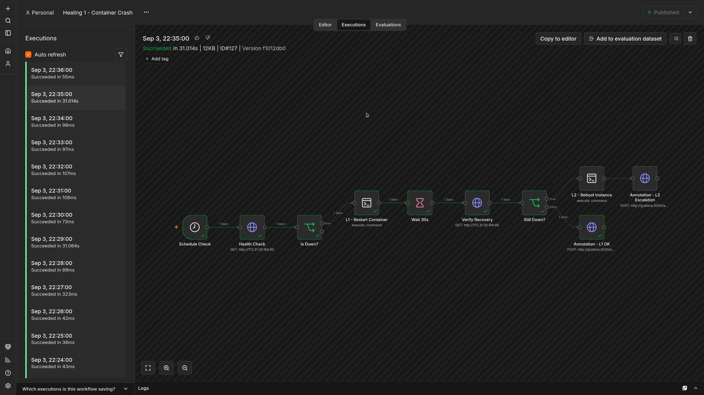
_Figura 9 – Esecuzione del workflow Healing 1 - successo L1._

#### Metriche e Verifiche

L'intervento è immediato e risolutivo al primo livello (L1). Sulla dashboard di Grafana, l'azione viene tracciata istantaneamente.

<a id="fig-10"></a>
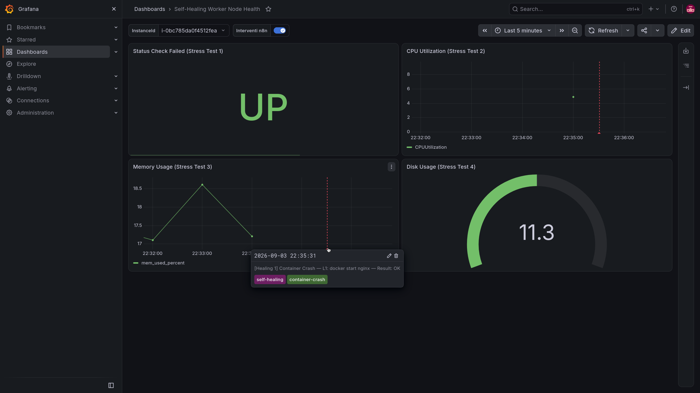
_Figura 10 – Annotation Grafana: Container Crash risolto._

### 3.9 Stress Test 2 - CPU Overload

#### Scenario e Trigger di Errore

L'esaurimento della capacità computazionale porta al degrado delle performance fino all'indisponibilità totale. L'allarme CloudWatch `selfhealing-monitoring-cpu-high` scatta quando l'utilizzo della CPU supera l'80% per 2 periodi consecutivi da 5 minuti.

#### Esecuzione del Chaos Test

Viene lanciato lo script `/opt/chaos/chaos-cpu.sh`. Sfruttando l'utility `stress-ng`, lo script genera fork intensivi e calcoli matematici complessi saturando intenzionalmente il 100% della CPU dell'istanza t3.micro.

<a id="fig-11"></a>
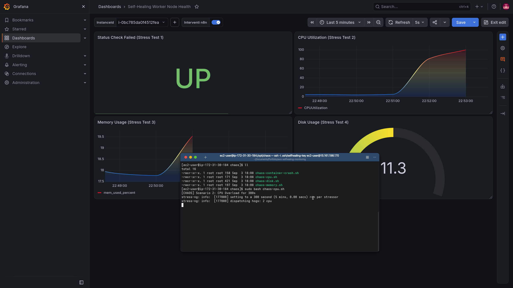
_Figura 11 – Terminale: esecuzione dello script chaos-cpu.sh._

#### Risposta Automatica del Sistema

Il router di n8n riceve l'allarme e invoca il workflow **Healing 2**. Durante i test sono stati osservati e documentati entrambi gli scenari di risoluzione:

1. **L1 Healed**: Il workflow si collega e termina (`kill -9`) chirurgicamente il processo `stress-ng` che consuma più risorse.
2. **L2 Escalation**: Quando lo stress è progettato per resistere o replicarsi (es. molteplici thread), la verifica dopo 90 secondi fallisce. Il workflow rileva la CPU ancora critica ed esegue un riavvio forzato (`sudo reboot`), risolvendo radicalmente l'anomalia.

#### Metriche e Verifiche

Le dinamiche di risoluzione, compresa la successiva transizione di stato verso `OK`, sono chiaramente documentate dalla sequenza di Annotations su Grafana, sia per l'escalation L2 che per il successo in L1.

<a id="fig-12"></a>
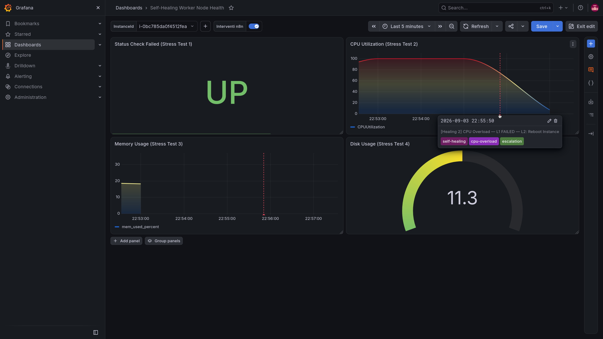
_Figura 12 – Dashboard Grafana post-healing: CPU normalizzato._

---

---

## Sezione 4 - Chaos Engineering, Stress Test e Metriche

_Relatore 4_

### 4.1 Design degli Scenari di Test

Per validare oggettivamente l'intero stack, sono stati sviluppati quattro script Bash, posizionati sul Worker Node nella directory `/opt/chaos/`. Questi script iniettano degradi artificiali mirati per forzare il superamento delle soglie d'allarme di CloudWatch, permettendo di misurare empiricamente i tempi di detection, i tempi di remediation e l'efficacia dei quattro workflow n8n.

### 4.2 Stress Test 3 - Memory Leak

#### Scenario e Trigger di Errore

Una saturazione della RAM spesso porta al blocco totale del sistema operativo (OOM panic). CloudWatch monitora l'uso effettivo della RAM grazie al CloudWatch Agent installato sul Worker Node, scattando in caso di superamento della soglia critica.

#### Esecuzione del Chaos Test

L'esecuzione di `/opt/chaos/chaos-memory.sh` istruisce `stress-ng` (`--vm`) ad allocare aggressivamente ampi blocchi di memoria RAM, senza mai rilasciarli, simulando un memory leak applicativo. L'effetto è visibile come uno spike netto sui grafici Grafana.

<a id="fig-13"></a>
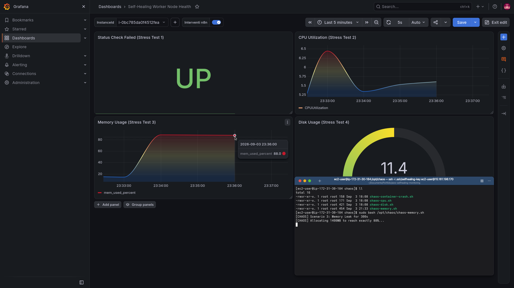
_Figura 13 – Terminale + Grafana: esecuzione chaos-memory.sh con spike visibile._

#### Risposta Automatica del Sistema

L'allarme viene ricevuto dal Router e smistato al workflow **Healing 3**. Il sistema individua il processo con la maggiore occupazione di RAM e ne forza la terminazione.

#### Metriche e Verifiche

Il rilascio di memoria è immediato. Il check post-90 secondi conferma il successo dell'intervento L1, inserendo l'annotazione su Grafana e scongiurando l'escalation L2.

<a id="fig-14"></a>
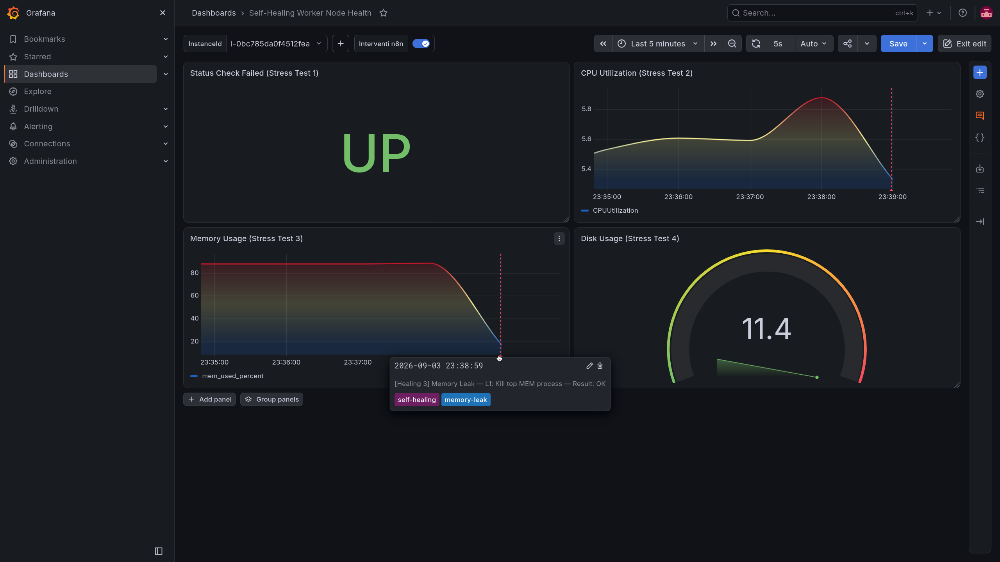
_Figura 14 – Annotation Grafana: Memory Leak - L1 healed._

### 4.3 Stress Test 4 - Disk Full

#### Scenario e Trigger di Errore

L'esaurimento dello spazio disco impedisce la scrittura di nuovi dati e log, bloccando spesso i database e i container. L'allarme CloudWatch viene innescato dalla metrica fornita dall'agent che valuta la percentuale di riempimento della partizione root.

#### Esecuzione del Chaos Test

Lo script `/opt/chaos/chaos-disk.sh` utilizza il comando `dd` per generare rapidamente file fittizi di grandi dimensioni costituiti da byte nulli, fino a riempire artificialmente il 90% della capacità del disco.

<a id="fig-15"></a>
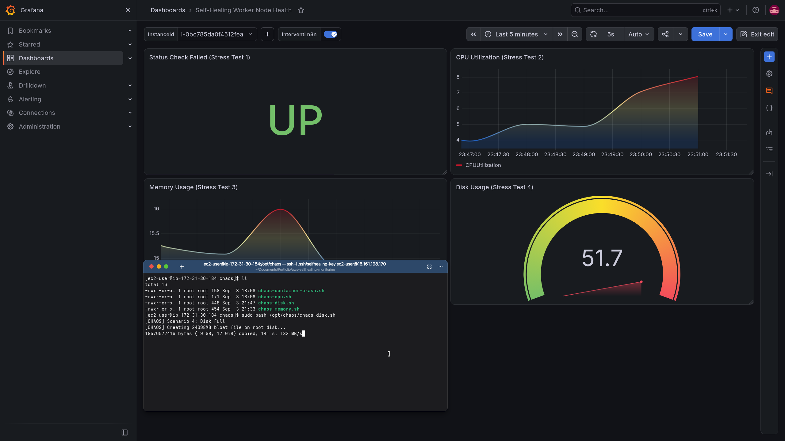
_Figura 15 – Terminale + Grafana: esecuzione chaos-disk.sh con gauge al 51.7%._

#### Risposta Automatica del Sistema

Ricevuta la notifica, n8n esegue il workflow **Healing 4**. Viene avviata una routine aggressiva di cleanup a livello 1: potatura di container e immagini docker inutilizzate, cancellazione dei file temporanei, e rotazione/vacuum dei log di sistema per liberare blocchi contigui sul filesystem.

#### Metriche e Verifiche

Il gauge di Grafana registra una discesa ripida immediata a seguito della pulizia, riportando il disco ai valori normali (es. 12%). L'annotazione di successo L1 conferma l'efficacia del cleanup.

<a id="fig-16"></a>
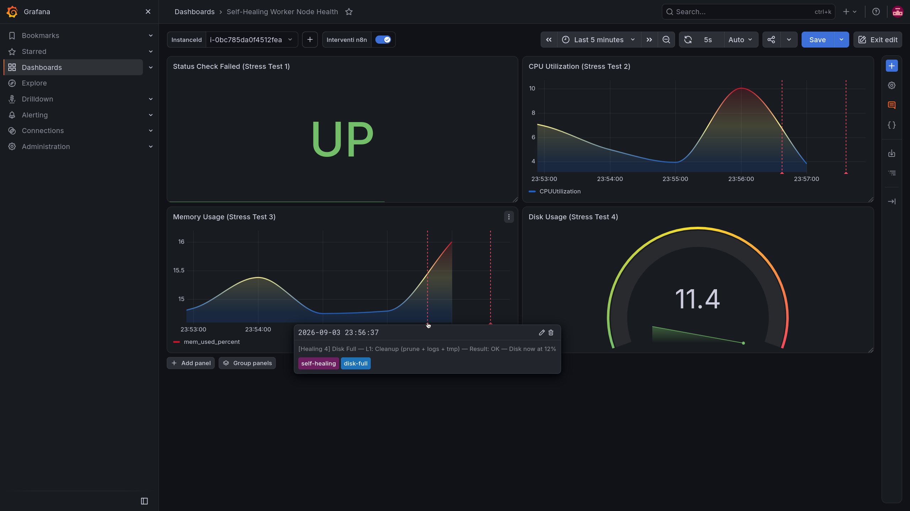
_Figura 16 – Annotation Grafana: Disk Full - L1 cleanup riuscito._

### 4.4 Tabella Riepilogativa dei Risultati

| Scenario        | Detection | Remediation             | Livello | Esito |
| --------------- | --------- | ----------------------- | ------- | ----- |
| Container Crash | ~60s      | ~30s                    | L1      | ✅ OK |
| CPU Overload    | ~60s      | ~90s (L1) / ~2 min (L2) | L1 / L2 | ✅ OK |
| Memory Leak     | ~60s      | ~90s                    | L1      | ✅ OK |
| Disk Full       | ~60s      | ~60s                    | L1      | ✅ OK |

### 4.5 Lezioni Apprese e Miglioramenti Futuri

Il progetto dimostra la fattibilità di un'architettura self-healing puramente event-driven costruita con servizi standard cloud e orchestration webhook, mantenendo i costi operativi rasenti allo zero durante i periodi di stallo.
Possibili evoluzioni future per ambienti su larga scala includono:

- **Integrazione con Kubernetes**: Sostituire Docker Compose nativo su EC2 con EKS per demandare nativamente all'orchestratore il riavvio dei pod, limitando n8n a operazioni infrastrutturali complesse.
- **Machine Learning Detection**: Passare da soglie statiche CloudWatch a rilevamento anomalie basato su Machine Learning (CloudWatch Anomaly Detection) per prevenire il guasto ancor prima del superamento critico.
- **Auto-Scaling Orizzontale**: Aggiungere un livello intermedio in cui la remediation tenti lo scale-out del gruppo di istanze (ASG) in risposta a carichi imprevisti, invece di terminare i processi
